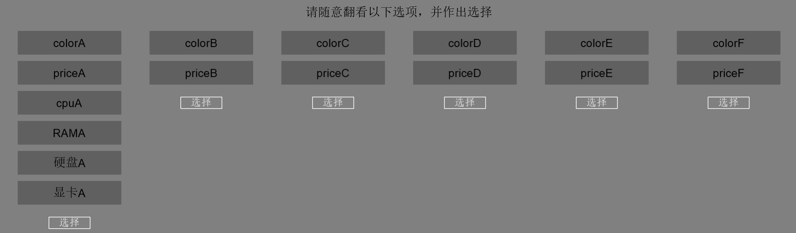
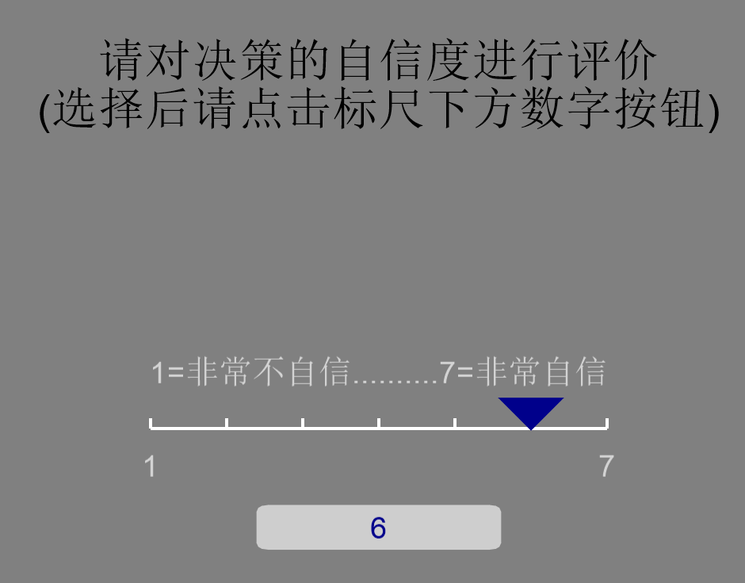

# zxMouselab


本仓库是使用Psychopy实现的类似Mouselab的决策过程追踪工具zxMouselab，可以用于完成信息板(Information Display Board, IDB)实验。



支持决策自信度评价量表：


由于本人水平有限，该工具的实现还有诸多不够完善的地方，可以在Issues中提出，我也会继续改进。 

:yellow_heart: :blue_heart: :purple_heart: :heart: :green_heart: I'm not majoring in psychology. I'm majoring in computer science and technology. This repository is written for my sister :girl: , who is majoring in psychology.

## 目录

- [zxMouselab](#zxMouselab)
  - [目录](#%e7%9b%ae%e5%bd%95)
  - [安装](#%e5%ae%89%e8%a3%85)
  - [使用](#%e4%bd%bf%e7%94%a8)
    - [设置信息板](#设置信息板)
    - [运行](#运行)
    - [数据](#数据)
  - [License](#license)

## 安装

需要安装以下依赖：
- Python >= 3.7
- PsychoPy >= 2020.2.4.post1

## 使用

### 设置信息板
tests目录下存放不同的信息板，一个信息板一个文件。注意所有存放在tests目录下的文件都会被受试者使用。

每个文件的格式为（请勿在文件中输入#及之后的内容）：
```plain
请随意翻看以下选项，并作出选择
7 # the number of options
电脑A # option name
6 # the number of choices in an option
colorA black # each option: option_name option_value
priceA 4999RMB #...
cpuA Intel
RAMA 8GB
硬盘A 1TB
显卡A 独立显卡
电脑B # the next option
2 #...
colorB pink #...
priceB 7999RMB #...
```

### 运行
在PsychoPy中或在Python环境中（确保安装了PsychoPy依赖）运行zxMouselab.py即可。

### 数据
在results目录下有三个数据文件：

xxx_detail.csv记录了完整的受试者操作序列，包括受试者ID、测试ID、action和持续时间(s)

xxx_sum.csv记录了受试者ID、测试ID、最终选择以及在每个属性上停留的总时间(s)

xxx_rating.txt记录了最后的自信度评价量表结果，包括rating、desicion time以及choice history，choice history是选择的自信度和选择时间(click time)，最后一行代表的是确认时间。

## License
[GPL](https://github.com/Bil369/zxMouselab/blob/master/LICENSE) &copy; [Bil369](https://github.com/Bil369)